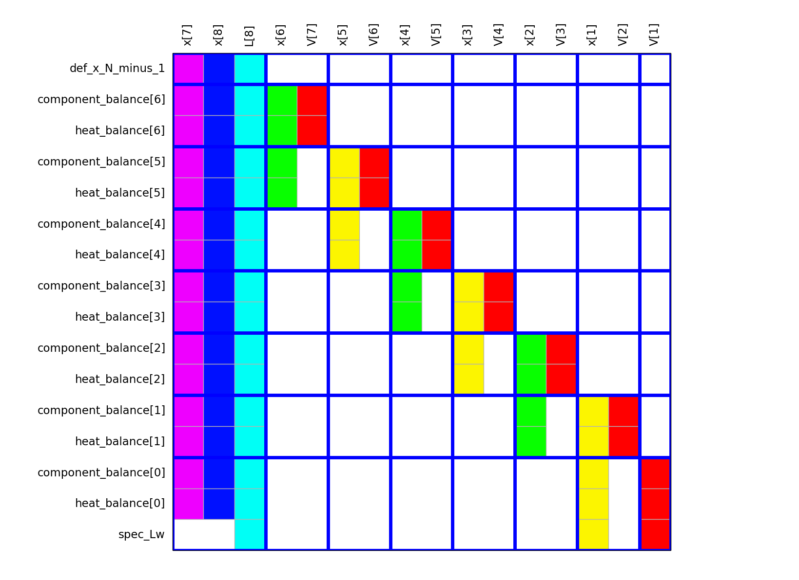

.. SDOPT documentation master file, created by
   sphinx-quickstart on Thu Oct  2 00:47:20 2014.
   You can adapt this file completely to your liking, but it should at least
   contain the root `toctree` directive.

Structure-Driven OPTimization methods for modular technical systems
===================================================================

.. _structure-driven:

- The term **structure-driven** refers to the following idea. First, we partition 
  the large, sparse nonlinear model of a technical system into smaller 
  subproblems. Then, a suitable ordering of these smaller problems is determined 
  so that the solution to the original problem can be reconstructed from the 
  solutions of the smaller ones. The decomposition just sketched resembles the
  `tree decomposition <http://en.wikipedia.org/wiki/Tree_decomposition#Dynamic_programming>`_, 
  which is very popular in discrete optimization and constraint satisfaction; this 
  project deals with *continuous* problems. Evidence shows that appropriate 
  decomposition can speed up the computations by several orders of magnitude.

- `Nonlinear programming <http://en.wikipedia.org/wiki/Nonlinear_programming>`_
  is meant by **optimization**.

- The image below shows an example of a **modular technical system**
  (a heating system, the image has been taken from the 
  `Modelica website <https://www.modelica.org/news_items/release_of_modelica_fluid_1_0>`_).
  Component-based modeling is well suited for modular technical systems; 
  `Simulink <http://en.wikipedia.org/wiki/Simulink>`_ and 
  `Dymola <http://en.wikipedia.org/wiki/Dymola>`_ are examples of component-based 
  modeling tools. The modules (components) of the technical systems help in 
  decomposing the large model into smaller problems.

The `source code is available on GitHub <https://github.com/baharev/SDOPT>`_ 
under the 3-clause BSD license.
   
.. raw:: html

   
<b>THIS PROJECT IS A WORK IN PROGRESS.</b>

Input
-----

Currently, the models are written in `AMPL <http://en.wikipedia.org/wiki/AMPL>`_,
and after some black magic, the expressions are built-up in memory as a 
direct acyclic graph (DAG), using
`NetworkX DiGraph <http://networkx.github.io/documentation/latest/reference/classes.digraph.html>`_.
It is somewhat similar to the 
`expression trees <http://docs.sympy.org/latest/tutorial/manipulation.html>`_ in 
SymPy. Only nonlinear systems of equations are considered at the moment 
(steady-state modeling).

For example, the following AMPL code  ::

    var x; var y; var z;
    equation: exp(3*x+2*y)+4*z = 1;

yields the directed acyclic graph below.

   
In the future, I would like to use either Python or 
`JuMP <https://github.com/JuliaOpt/JuMP.jl>`_ for building the models. 
In any case, I will keep the AMPL interface too. 
`Modelica <http://en.wikipedia.org/wiki/Modelica>`_ is definitely on the agenda, 
accessed through the 
`functional mock-up interface <http://en.wikipedia.org/wiki/Functional_Mock-up_Interface>`_.
This project is not aiming at creating yet another modeling environment: The 
goal is to plug the tools of this project into well-established modeling 
systems.

Reverse mode automatic differentiation
--------------------------------------
Source code is generated from the DAG representation of the expressions 
in order to compute the 
`Jacobian <http://en.wikipedia.org/wiki/Jacobian_matrix_and_determinant>`_
with reverse mode 
`automatic differentiation <http://en.wikipedia.org/wiki/Automatic_differentiation>`_. 
Currently only Python code is emitted, in the near future, templated C++ code 
will also be generated. For example, for the above example `exp(3*x+2*y)+4*z`
the following Python code is generated (hand-edited to improve readability)::

    # f = exp(3*x+2*y)+z
    # Forward sweep
    t1 = 3.0*x + 2.0*y
    t2 = exp(t1)
    f = 4.0*z + t2 - 1.0
    # Backward sweep
    u0 = 1.0
    u1 = 4.0 * u0  # df/dz = 4
    u2 = u0
    u3 = t2 * u2
    u4 = 3.0 * u3  # df/dx = 3*exp(3*x+2*y)
    u5 = 2.0 * u3  # df/dy = 2*exp(3*x+2*y)

The templated C++ version of this code will greatly benefit from code 
optimization performed by the C++ compiler; I expect the generated code to be 
as good as hand-written.

Natural block structure
-----------------------
The modules of the technical systems partition the Jacobian into blocks in a 
fairly natural way. This natural block structure plays an important role in 
:ref:`structure-driven algorithms <structure-driven>`: Computing the optimal 
partitioning and ordering of the smaller subproblems is NP-hard in the general 
case; one must resort to heuristics in practice. Independent results show that 
the heuristic which exploits the natural block structure often yields good 
quality partitioning and ordering.

The current way to pass the natural blocks is rather hackish: Suffixes are 
used, see *Defining and using suffixes* on page 302 in the 
`AMPL book <http://ampl.github.io/ampl-book.pdf>`_. In the future, component-based
modeling tools will hopefully allow programmatic access to the natural block 
structure.

Minimum degree ordering
-----------------------
A basic minimum degree ordering has been implemented. The blue lines show the 
natural block structure.

My primary interest is chemical process modeling. The Jacobian of these models 
are very sparse but *highly* unsymmetric, numerically indefinite, not diagonally 
dominant and possibly ill-conditioned. There are many packages for the symmetric 
and slightly unsymmetric case. (In the slightly unsymmetric case, it is 
acceptable to introduce artificial fill-in to make the sparsity pattern 
symmetric and then use a sparse matrix ordering algorithm, developed for the 
symmetric case.) I have only found 
`MC33 from the Harwell Subroutine Library <http://www.hsl.rl.ac.uk/catalogue/mc33.html>`_
that is applicable in the highly unsymmetric case. Since MC33 is based on a 
heuristic, it unfortunately fails on those chemical process models that are of 
interest to me.

Graph coloring
--------------
Depending on the implementation, efficient forward-mode 
`automatic differentiation <http://en.wikipedia.org/wiki/Automatic_differentiation>`_
may require well-chosen seed vectors; these seeds can be computed with 
`graph coloring <http://en.wikipedia.org/wiki/Graph_coloring>`_. Even though graph 
coloring is NP-complete in general, the minimum degree ordering enables an 
efficient 
`greedy coloring heuristic <http://en.wikipedia.org/wiki/Greedy_coloring>`_.

    

Documentation generated with sphinx.ext.autodoc
-----------------------------------------------
    
Contents:

.. toctree::
   :maxdepth: 4

   main
   ordering
   parsers
   representation

Indices and tables
==================

* :ref:`genindex`
* :ref:`modindex`
* :ref:`search`

